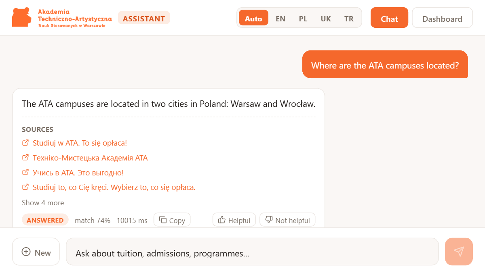
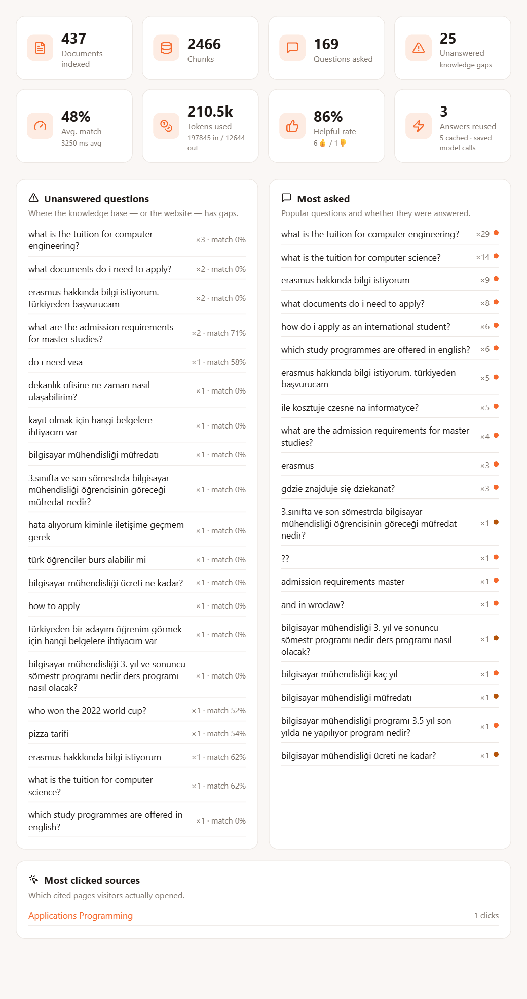
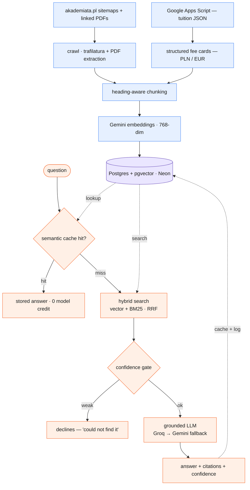
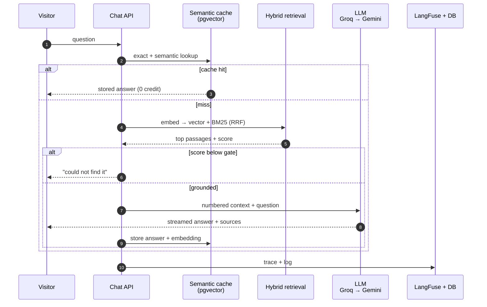

<div align="center">

# 🎓 ATA RAG

**A retrieval-augmented assistant for [akademiata.pl](https://akademiata.pl)** — ask about tuition, admissions, programmes or student services and get a grounded, sourced answer in the language you asked in.


</div>

---

## What it does

A visitor asks a question in plain language. The assistant retrieves the most relevant passages from the university's own website, and — only if that context actually supports an answer — has an LLM write a reply grounded in it, with the source pages linked. It answers in **English, Polish, Ukrainian or Turkish**, streams the reply as it is written, and remembers the conversation so follow-ups ("and in Wrocław?") resolve.

A separate **dashboard** shows what people ask, which questions the knowledge base *cannot* answer, retrieval quality, token usage, feedback and cache savings — the observability the project is graded on.

<div align="center">

### Chat
*Grounded answer with cited sources, confidence score and per-answer feedback.*



### Dashboard
*Live observability: usage, knowledge gaps, retrieval quality, token spend, feedback and cache savings.*



</div>

## Why it is built this way

Two findings from studying the site shaped the design:

1. **The public site is `akademiata.pl`, not `akademiata.edu.pl`** (the latter is the Moodle e-learning login). Easy to get wrong, and it would quietly break the whole deliverable.
2. **Tuition figures are not in the page HTML.** Programme pages only link to a JavaScript "tuition calculator" that loads its numbers from a Google Apps Script endpoint. A crawl-and-embed pipeline alone therefore *cannot* answer "what is tuition for Computer Science?". We ingest that structured pricing data directly and turn each programme into a fact card — so the single most-asked question is answered from data, exact and sourced, not from scraped prose.

## Feature highlights

| | |
|---|---|
| 🔎 **Hybrid retrieval** | Dense vectors **+** BM25 full-text, fused with Reciprocal Rank Fusion — meaning *and* exact tokens ("Erasmus", a fee, a programme name). |
| 🛑 **Confidence gate** | Weak match → the bot says it could not find it instead of guessing. A wrong tuition figure is worse than "I don't know". |
| 🌍 **Cross-lingual, 4 languages** | One multilingual embedding space: a Polish page answers an English question. Reply language is detected from the question or chosen in the UI. |
| 📄 **PDF ingestion** | Regulations and fee tables are published as PDFs, invisible to an HTML crawl — their text is extracted and indexed too. |
| 💸 **Structured tuition** | Fees come from the calculator's data source as per-programme cards (PLN for domestic, EUR for international), quoted exactly. |
| ⚡ **Streaming answers** | Server-Sent Events; the reply types out instead of arriving after a multi-second wait. Falls back to a single response on browsers (iOS Safari) whose streaming `fetch` is unreliable. |
| 🧠 **Persistent semantic cache** | An answered question is stored *with its embedding*; a repeat — or a paraphrase — is served from the vector DB for **zero model credit**, and survives redeploys. |
| 🧵 **Conversation memory** | Follow-ups resolve against the recent exchange without contaminating unrelated questions. |
| 🛡️ **Resilient by design** | Multi-provider LLM fallback and a BM25-only mode keep the assistant answering even when a free-tier quota is spent (see below). |
| 🔒 **Hardened** | Prompt-injection defence around untrusted page content, plus per-client rate limiting. |
| 📊 **Observability** | LangFuse traces every answer; a built-in dashboard surfaces questions, gaps, quality, tokens, feedback and cache savings. |

## Architecture



## How answering works

1. **Cache first.** The question is checked against a persistent semantic cache — an exact match, then the nearest past question in pgvector. A hit returns the stored answer with no retrieval and no model call.
2. **Retrieve.** Otherwise the question is embedded once and run through hybrid search: pgvector cosine similarity fused with Postgres full-text ranking via RRF.
3. **Gate.** The best cosine score is compared to a calibrated floor. Below it, the assistant declines rather than answer from weak context.
4. **Generate.** The top passages become numbered context for the LLM, which is instructed to answer *only* from them, in the reader's language, and never to invent figures.
5. **Remember.** The answer is cached (in-process and in the vector DB) and logged for the dashboard and LangFuse.



## Free-tier resilience

Every dependency here is a free tier with a hard daily cap, and the app is built so that hitting one **degrades** rather than goes dark:

- **Answering LLM out of credit** (Groq, 100k tokens/day) → falls through a chain of **Gemini** models, each with its own separate daily bucket.
- **Query embedding out of quota** (Gemini, ~1000/day, shared with indexing) → retrieval falls back to **BM25-only** full-text search, which needs no embedding; keyword-matchable questions keep working.
- **Indexing** stops short of the daily embedding budget so it never starves live queries, and resumes the next night (unchanged pages are skipped by content hash).
- **Database briefly unreachable** under host load → endpoints return a calm "temporarily busy" message, not a raw 500.

Total failure now requires both providers *and* the database to be down at once.

## Components

| Part | Path |
|---|---|
| Crawler (sitemap-driven, incremental via `lastmod`) | `backend/app/ingest/crawler.py` |
| PDF discovery + text extraction | `backend/app/ingest/pdfs.py` |
| Structured tuition ingestion (PLN + EUR) | `backend/app/ingest/prices.py` |
| Heading-aware chunker | `backend/app/ingest/chunker.py` |
| Embeddings (Gemini, 768-dim, normalised) | `backend/app/core/embeddings.py` |
| Vector store, hybrid search, semantic cache | `backend/app/core/db.py` |
| Answer + rate-limit caches | `backend/app/core/cache.py` |
| RAG answering (gate · fallback · streaming · language) | `backend/app/services/rag.py` |
| Chat API | `backend/app/routers/chat.py` |
| Dashboard analytics API | `backend/app/routers/dashboard.py` |
| Indexing orchestrator (nightly) | `backend/app/ingest/indexer.py` |
| Frontend (chat + dashboard) | `frontend/` |

## Getting started

```bash
cd backend
pip install -r requirements.txt
cp .env.example .env          # fill in the secrets below

python -m app.ingest.indexer  # crawl + PDFs + tuition + embed into pgvector
uvicorn app.main:app --reload
```

```bash
cd ../frontend
npm install
npm run dev                   # http://localhost:5174
```

Ask from the command line:

```bash
curl -X POST localhost:8000/chat/ask \
  -H 'Content-Type: application/json' \
  -d '{"question":"What is the tuition for Computer Science?"}'
```

## Configuration

Secrets are read under their **provider-native names** (no prefix); everything else is overridable with the `ATARAG_` prefix or in `.env`.

| Variable | Purpose |
|---|---|
| `GOOGLE_API_KEY` | Gemini — embeddings, and the fallback answering model |
| `LLM_API_KEY` | Primary answering LLM (Groq, OpenAI-compatible) |
| `DATABASE_URL` | Postgres + pgvector (Neon) |
| `LANGFUSE_PUBLIC_KEY` / `LANGFUSE_SECRET_KEY` / `LANGFUSE_HOST` | Optional — enables answer tracing |
| `ATARAG_CORS_ORIGINS` | JSON list of allowed frontend origins in production |
| `ATARAG_MIN_SIMILARITY` · `ATARAG_QA_CACHE_SIMILARITY` · `ATARAG_EMBED_CHUNKS_PER_RUN` | Retrieval / cache / indexing tuning (sensible defaults) |

## Observability

Every answer is traced in LangFuse — retrieval, prompt, model output, latency and tokens — when `LANGFUSE_*` keys are set, and every question (answered or not) is logged to the `queries` table. The dashboard surfaces common questions, **unanswered ones** (where the knowledge base has gaps), retrieval quality, token usage, feedback and **cache savings** (how many model calls the semantic cache has spared). `GET /health` reports live tracing status.

## Evaluation

A golden set of ~25 questions (`backend/eval/cases.json`) covers the behaviours that matter — tuition figures, admissions, programmes, the four reply languages, the scope guardrail and the prompt-injection defence — each with declared expectations (facts that must appear, forbidden strings, the answer's language, answered vs declined). `run_eval` scores them and fails below a pass-rate threshold, so a change that breaks one shows up immediately.

```bash
cd backend
python -m eval.run_eval                                   # in-process
python -m eval.run_eval --api https://…  --delay 3        # a deployed instance
python -m eval.run_eval --category scope                  # one slice
```

## Deployment (Coolify)

Three resources, all pointing at the same Neon database:

| Resource | Type | Notes |
|---|---|---|
| **backend** | Dockerfile (`/Dockerfile`), port 8000 | env: `GOOGLE_API_KEY`, `LLM_API_KEY`, `DATABASE_URL`, optional `LANGFUSE_*`, `ATARAG_CORS_ORIGINS` |
| **frontend** | Dockerfile (`/frontend/Dockerfile`), port 80 | build arg `VITE_API_URL` = the backend's public URL (must be **Available at Buildtime**) |
| **crawler** | Scheduled task, nightly `0 2 * * *` | `python -m app.ingest.indexer` — same env as backend |

> **Domain tip:** enter the app domains as `http://…` in Coolify — Cloudflare terminates TLS in front, and an `https://` origin causes a redirect loop.

## Nightly refresh

The scheduled task re-crawls and re-embeds only what changed: the sitemap's `lastmod` skips unmodified pages before they are even fetched, and a content hash skips pages whose text came back identical. Tuition cards are always refreshed. The ivfflat vector index is (re)built automatically once the corpus is large enough, and both cache layers are cleared so new content shows.

## License

MIT
